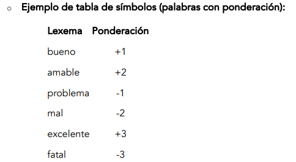

# Informe del Trabajo Práctico: Análisis de Interacciones en Contact Centers con Speech Analytics y Tokenización

# Resumen Ejecutivo

El objetivo de este trabajo práctico es implementar un sistema integral que procese las interacciones comunes en un Contact Center y que, utilizando técnicas avanzadas de tokenización, identifique palabras clave, evalúe la calidad de la comunicación y verifique el seguimiento del protocolo de atención al cliente.

A continuación se describen todos los puntos del trabajo práctico que fueron considerados, se explican las decisiones adoptadas, el código fuente utilizado para los puntos programables y se incluyen capturas de pantalla de las diferentes partes del sistema.

## 1. Preprocesamiento

### 1.1 Entrada de datos (audio a texto)


Interfaz de carga de conversaciones

**Código fuente que resuelve este punto:**

```python
def cargar_conversacion(self):
    """Permite cargar conversaciones desde archivos de texto"""    
    archivo = filedialog.askopenfilename(
        title="Seleccionar archivo de conversación",
        filetypes=[("Archivos de texto", "*.txt"), ("Todos los archivos", "*.*")]
    )
def cargar_ejemplo(self):
    """Carga una conversación de ejemplo predefinida"""    
    ejemplo = """Agente: Hola, bienvenido al servicio de Atención al Cliente...Cliente: Buenas, mi nombre es Juan Arias..."""
```

**Explicación:** Se implementó una interfaz gráfica que simula la entrada de transcripciones de conversaciones. El sistema permite cargar conversaciones desde archivos de texto y proporciona un ejemplo predefinido de conversación entre agente y cliente.

Para la obtención de los textos, se utilizó el siguiente proceso:
1. Extracción de audio desde videos utilizando herramientas especializadas
2. Transcripción del audio a texto mediante inteligencia artificial
3. Separación automática de la conversación entre “Agente:” y “Cliente:”

### 1.2 Tokenización

En esta sección del trabajo se abordan los siguientes puntos fundamentales:

### 1.2.1 Implementación del tokenizador para segmentación

**Código fuente:**

```python
def tokenizar(self, texto):
    """Segmenta el texto en palabras individuales (lexemas)"""    
    palabras = re.findall(r'\b\w+\b', texto.lower())
```

**Explicación:** El proceso de tokenización divide todo el texto recibido en lexemas (palabras) utilizando expresiones regulares. Se convierte todo el texto a minúsculas para facilitar el análisis posterior y garantizar consistencia en las comparaciones.

### 1.2.2 Categorización de lexemas según criterios establecidos

**Código fuente:**

```python
# Creación de la tabla de símbolos en inicializar_bd()
cursor.execute('''    CREATE TABLE palabras (        id INTEGER PRIMARY KEY,        lexema TEXT UNIQUE,        token TEXT,        puntuacion INTEGER    )''')
# Palabras iniciales con sus categorías y puntuacionespalabras_iniciales = [
    ('bueno', 'positivo', 1),
    ('amable', 'positivo', 2),
    ('problema', 'negativo', -1),
    ('mal', 'negativo', -2),
    ('excelente', 'positivo', 3),
    ('fatal', 'negativo', -3),
    ('hola', 'saludo', 1),
    ('bienvenido', 'saludo', 1),
    ('gracias', 'despedida', 1),
    ('nombre', 'identificacion', 0),
    ('inútil', 'prohibida', -3),
    ('tonto', 'prohibida', -3),
    ('al', 'articulo', 0),
    ('el', 'articulo', 0),
    ('la', 'articulo', 0),
    ('de', 'preposicion', 0),
    ('en', 'preposicion', 0),
    ('con', 'preposicion', 0)
]
cursor.executemany('INSERT INTO palabras (lexema, token, puntuacion) VALUES (?, ?, ?)',
                  palabras_iniciales)
# Carga de palabras en memoria
def cargar_palabras(self):
    self.palabras = {}
    cursor.execute('SELECT lexema, token, puntuacion FROM palabras')
    for lexema, token, puntuacion in cursor.fetchall():
        self.palabras[lexema.lower()] = (token, puntuacion)
# Estructura resultante:# {#     'bueno': ('positivo', 1),#     'problema': ('negativo', -1),#     'tonto': ('prohibida', -3)# }
```

**Explicación:** Se diseñó una estructura de datos robusta para la base de datos que se compone de tres elementos principales: lexema, token y puntuación. Esta estructura permite una categorización eficiente y un análisis de sentimiento preciso.

### 1.2.3 Identificación de lexemas en el texto

**Código fuente:**

```python
def tokenizar(self, texto):
    for palabra in palabras:
        if palabra.lower() in self.palabras:
            token, puntuacion = self.palabras[palabra.lower()]
            tokens.append((palabra, token, puntuacion))
```

**Explicación:** El sistema recorre cada palabra encontrada en el texto y verifica su existencia en la base de datos. Si la palabra existe, se obtienen su token correspondiente y su puntuación, información que resulta fundamental para la generación del reporte final.

### 1.2.4 Base de datos como tabla de símbolos


Base de datos SQLite

**Código fuente:**

```python
def inicializar_bd(self):
    cursor.execute('''        
    CREATE TABLE palabras (            
    id INTEGER PRIMARY KEY,            
    lexema TEXT UNIQUE,            
    token TEXT,            
    puntuacion INTEGER        
    )    
    ''')
```

**Explicación:** Se optó por utilizar SQLite como sistema de gestión de base de datos debido a su simplicidad y eficiencia para este tipo de aplicaciones. La tabla “palabras” almacena todos los lexemas y funciona como tabla de símbolos del sistema.

### 1.2.5 Manejo de palabras no encontradas

Cuando una palabra no se encuentra en la base de datos, el sistema ejecuta el siguiente protocolo:

### a) Despliegue de la palabra candidata


Diálogo de palabra desconocida

**Código fuente:**

```python
def tokenizar(self, texto):
    for palabra in palabras:
        if palabra.lower() in self.palabras:
            # Procesamiento de palabras conocidas        
        else:
            palabra_resultado, procesada, correccion_info = self.mostrar_popup_palabra_desconocida(palabra, root)
def mostrar_popup_palabra_desconocida(self, palabra, root=None):
    # Crear diálogo para mostrar palabra desconocida    
    dialog = SugerenciasDialog(root, palabra, sugerencias)
```

**Explicación:** Cada vez que se encuentra una palabra no registrada en la base de datos, se despliega un diálogo interactivo que muestra la palabra candidata y permite al usuario tomar decisiones sobre su procesamiento.

### b) Validación y asignación de tokens


**Código fuente:**

```python
def procesar_palabra_con_sugerencia(self, palabra_seleccionada, root):
    """Procesa la palabra seleccionada y asigna token y puntuación"""    
    token_dialog = TokenDialog(root, "Asignar token",
                        f"¿A qué token pertenece '{palabra_seleccionada}'?\nSeleccione uno existente o escriba uno nuevo:",
                        tokens_disponibles)
    root.wait_window(token_dialog)
    if token:
        # Solicitar puntuación para análisis de sentimiento        
        puntuacion = simpledialog.askinteger("Asignar puntuación",
                                    f"¿Qué puntuación de sentimiento tiene '{palabra_seleccionada}'?\n(Número positivo o negativo)",
                                    parent=root)
        if puntuacion is not None:
            # Agregar palabra a la base de datos            
            self.agregar_palabra(palabra_seleccionada, token, puntuacion)
            return True    return False
```

**Explicación:** El sistema presenta diálogos secuenciales para cada aspecto del procesamiento:
1. **Validación del lexema**: Confirma si la palabra está correctamente escrita
2. **Asignación de token**: Permite seleccionar un token existente o crear uno nuevo
3. **Asignación de puntuación**: Establece valores positivos o negativos para el análisis de sentimiento

### c) Sugerencias basadas en técnicas de distancia


Sugerencias de palabras similares

**Implementación de algoritmos de distancia:**

1. **Distancia mínima de edición (Levenshtein)**
2. **Distancia de Hamming con relleno para igualar longitudes**

**Código fuente:**

```python
def distancia_levenshtein(self, s1, s2):
    """Implementa el algoritmo de distancia de Levenshtein"""    # Implementación completa del algoritmodef distancia_hamming(self, s1, s2):
    """Implementa la distancia de Hamming con relleno"""    # Implementación completa del algoritmodef sugerir_palabras_similares(self, palabra):
    """Combina ambas distancias para generar sugerencias óptimas"""    
    sugerencias = []
    for lexema in self.palabras.keys():
        dist_lev = self.distancia_levenshtein(palabra.lower(), lexema.lower())
        dist_ham = self.distancia_hamming(palabra.lower(), lexema.lower())
        dist = min(dist_lev, dist_ham)
        if dist <= 2:  # Umbral configurable            
        sugerencias.append((lexema, dist))
    return [s[0] for s in sorted(sugerencias, key=lambda x: x[1])[:5]]
```

**Explicación:** Se implementaron ambos algoritmos de distancia para obtener sugerencias precisas. El sistema calcula la distancia mínima entre ambos métodos y presenta sugerencias cuando la distancia es menor al umbral establecido (2). Las sugerencias se ordenan por relevancia y se limitan a las 5 mejores opciones.

## 2. Fase de Análisis - Speech Analytics

### 2.1 Análisis de Sentimiento

### 2.1.1 Carga de tabla de símbolos con ponderaciones



Tabla de símbolos con ponderaciones

**Código fuente:**

```python
# Inicialización de palabras con ponderacionespalabras_iniciales = [
    ('bueno', 'positivo', 1),
    ('amable', 'positivo', 2),
    ('problema', 'negativo', -1),
    ('excelente', 'positivo', 3),
    ('fatal', 'negativo', -3)
    # ... más palabras con sus respectivas ponderaciones]
def agregar_palabra(self, lexema, token, puntuacion):
    """Agrega nuevas palabras dinámicamente a la tabla de símbolos"""    
    conn = sqlite3.connect('tokenizador.db')
    cursor = conn.cursor()
    try:
        cursor.execute('INSERT INTO palabras (lexema, token, puntuacion) VALUES (?, ?, ?)',(lexema, token, puntuacion))
        conn.commit()
        self.palabras[lexema.lower()] = (token, puntuacion)
        print(f"Palabra '{lexema}' agregada con token '{token}' y puntuación {puntuacion}")
        return True    
     except sqlite3.IntegrityError:
        return False    
     finally:
        conn.close()
```

**Explicación:** La tabla de símbolos se carga en dos fases principales:
1. **Inicialización**: Carga de palabras predefinidas con sus ponderaciones
2. **Expansión dinámica**: Incorporación de nuevos lexemas identificados durante el procesamiento

### 2.1.2 Cálculo de puntuación acumulada

**Código fuente:**

```python
def analizar_sentimiento(self, tokens):
    """Calcula el sentimiento general basado en ponderaciones"""    puntuacion_total = sum(puntuacion for _, _, puntuacion in tokens)
    if puntuacion_total > 0:
        sentimiento = "Positivo"    
    elif puntuacion_total < 0:
        sentimiento = "Negativo"    
    else:
        sentimiento = "Neutral"    
        # Análisis detallado de palabras    
        palabras_positivas = [(palabra, puntuacion) for palabra, _, puntuacion in tokens if puntuacion > 0]
		    palabras_negativas = [(palabra, puntuacion) for palabra, _, puntuacion in tokens if puntuacion < 0]
    return {
        "sentimiento": sentimiento,
        "puntuacion_total": puntuacion_total,
        "palabras_positivas": len(palabras_positivas),
        "palabras_negativas": len(palabras_negativas),
        "palabra_mas_positiva": max(palabras_positivas, key=lambda x: x[1]) if palabras_positivas else None,
        "palabra_mas_negativa": min(palabras_negativas, key=lambda x: x[1]) if palabras_negativas else None    }
```

**Explicación:** El sistema implementa un análisis de sentimiento robusto basado en la suma ponderada de todas las palabras procesadas. El resultado determina si la conversación fue mayormente positiva, negativa o neutral.

### 2.2 Verificación del Protocolo de Atención

### 2.2.1 Detección de palabras clave para evaluación del protocolo

El sistema evalúa cuatro fases críticas del protocolo de atención:

- **Saludo**: Detección de palabras como “Hola”, “Buen día”
- **Identificación del cliente**: Frases como “¿Con quién tengo el gusto?”
- **Uso de palabras prohibidas**: Términos como “inútil”, “tonto”
- **Despedida amable**: Frases como “Gracias por su tiempo”

**Código fuente:**

```python
# Definición de categorías del protocolo
self.categorias_protocolo = {
    'saludo': ['hola', 'buenos días', 'buenas tardes', 'buenas noches', 'bienvenido'],
    'identificacion': ['nombre', 'con quién', 'con quien', 'identificarse', 'quién es', 'quien es'],
    'palabras_prohibidas': ['inútil', 'tonto', 'estúpido', 'idiota', 'molesto', 'incompetente'],
    'despedida': ['gracias', 'adiós', 'hasta luego', 'que tenga', 'buen día', 'buenas tardes']
}
def verificar_protocolo(self, tokens, es_agente=True):
    """Verifica el cumplimiento del protocolo de atención"""    if not es_agente:
        return None    texto = " ".join(palabra for palabra, _, _ in tokens).lower()
    resultados = {}
    # FASE 1: Verificación de saludo    
    tiene_saludo = any(saludo in texto for saludo in self.categorias_protocolo['saludo'])
    resultados['Fase de saludo'] = "OK" if tiene_saludo else "Faltante"    
    # FASE 2: Verificación de identificación del cliente    
    tiene_identificacion = any(ident in texto for ident in self.categorias_protocolo['identificacion'])
    resultados['Identificación del cliente'] = "OK" if tiene_identificacion else "Faltante"    # FASE 3: Detección de palabras prohibidas    
    palabras_prohibidas_usadas = [palabra for palabra in self.categorias_protocolo['palabras_prohibidas'] if palabra in texto]
    if palabras_prohibidas_usadas:
        resultados['Uso de palabras rudas'] = f"Detectadas: {', '.join(palabras_prohibidas_usadas)}"    else:
        resultados['Uso de palabras rudas'] = "Ninguna detectada"    
        # FASE 4: Verificación de despedida amable    
        tiene_despedida = any(despedida in texto for despedida in self.categorias_protocolo['despedida'])
    resultados['Despedida amable'] = "OK" if tiene_despedida else "Faltante"    return resultados
```

**Explicación:** La verificación del protocolo se basa en patrones predefinidos para cada fase. Cada categoría tiene sus patrones específicos que, al ser detectados, confirman el cumplimiento de esa fase del protocolo.

### 2.3 Implementación con Tokenización

**Ejemplo de funcionamiento:**
- “Hola, bienvenido a Atención al Cliente…” → Fase de saludo: OK
- “¿Con quién tengo el gusto?” → Identificación del cliente: OK

**Código fuente:**

```python
def procesar_conversacion(self, conversacion):
    """Procesa una conversación completa separando turnos de agente y cliente"""    
    turnos = re.split(r'(Agente:|Cliente:)', conversacion)
    turnos = [t.strip() for t in turnos if t.strip()]
    resultados = {
        "tokens_totales": [],           # Para análisis de sentimiento general        
        "tokens_agente": [],            # Para verificación de protocolo        
        "protocolo": None,              # Resultado de verificación del protocolo        
        "correcciones_totales": []      # Registro de correcciones realizadas    
        }
    i = 0    while i < len(turnos):
        if turnos[i] == "Agente:" and i + 1 < len(turnos):
            tokens, correcciones = self.tokenizar(turnos[i + 1])
            resultados["tokens_totales"].extend(tokens)
            resultados["tokens_agente"].extend(tokens)
            resultados["correcciones_totales"].extend(correcciones)
            i += 2        elif turnos[i] == "Cliente:" and i + 1 < len(turnos):
            tokens, correcciones = self.tokenizar(turnos[i + 1])
            resultados["tokens_totales"].extend(tokens)
            resultados["correcciones_totales"].extend(correcciones)
            i += 2        
            else:
            i += 1    # Análisis de sentimiento general (agente + cliente)    
            if resultados["tokens_totales"]:
        resultados["sentimiento_general"] = self.analizar_sentimiento(resultados["tokens_totales"])
    # Verificación de protocolo (solo agente)    
	    if resultados["tokens_agente"]:
        resultados["protocolo"] = self.verificar_protocolo(resultados["tokens_agente"], es_agente=True)
    return resultados
```

**Explicación:** Esta función constituye el núcleo del tokenizador. El proceso incluye:

1. **Separación de turnos**: División de la conversación entre agente y cliente usando expresiones regulares
2. **Procesamiento diferenciado**: Análisis separado de tokens para cada participante
3. **Análisis integral**: Evaluación del sentimiento general y verificación del protocolo
4. **Consolidación de resultados**: Generación de un objeto completo con todos los análisis

## 3. Resultados y Reporte


Interfaz de resultados

### 3.1 Detección de Sentimiento

**Formato de reporte esperado:**

```
Sentimiento general: Positivo (+5)
Palabras positivas: 6
Palabra más positiva: amable, +2
Palabras negativas: 2
Palabra más negativa: mal, -2
```

**Código fuente:**

```python
def generar_reporte(self, resultados):
    """Genera un reporte completo del análisis realizado"""    
    reporte = "=== REPORTE DE ANÁLISIS DE CONVERSACIÓN ===\n\n"    
    if "sentimiento_general" in resultados:
        s = resultados["sentimiento_general"]
        reporte += "SENTIMIENTO GENERAL DE LA CONVERSACIÓN:\n"        
        reporte += f"Sentimiento general: {s['sentimiento']} ({s['puntuacion_total']})\n"        
        reporte += f"Palabras positivas: {s['palabras_positivas']}\n"        
        if s['palabra_mas_positiva']:
            reporte += f"Palabra más positiva: {s['palabra_mas_positiva'][0]}, +{s['palabra_mas_positiva'][1]}\n"        
            reporte += f"Palabras negativas: {s['palabras_negativas']}\n"        
            if s['palabra_mas_negativa']:
            reporte += f"Palabra más negativa: {s['palabra_mas_negativa'][0]}, {s['palabra_mas_negativa'][1]}\n"        
            reporte += "\n"
            # Estructura del objeto sentimiento_general:# {
            #     "sentimiento": sentimiento,
            #     "puntuacion_total": puntuacion_total,
            #     "palabras_positivas": len(palabras_positivas),
            #     "palabras_negativas": len(palabras_negativas),
            #     "palabra_mas_positiva": palabra_mas_positiva,
            #     "palabra_mas_negativa": palabra_mas_negativa# }
```

**Explicación:** El sistema genera reportes detallados que incluyen métricas específicas sobre el sentimiento detectado, proporcionando información valiosa para la evaluación de la calidad del servicio.

### 3.2 Verificación del Protocolo de Atención

**Formato de reporte esperado:**

```
Fase de saludo: OK
Identificación del cliente: OK
Uso de palabras rudas: Ninguna detectada
Despedida amable: Faltante
```

**Código fuente:**

```python
def generar_reporte(self, resultados):
    # ... sección de sentimiento general ...    
    if resultados.get("protocolo"):
        reporte += "VERIFICACIÓN DEL PROTOCOLO DE ATENCIÓN (AGENTE):\n"        
        for fase, estado in resultados["protocolo"].items():
            reporte += f"{fase}: {estado}\n"        
            reporte += "\n"
            # Estructura del objeto protocolo:
            # {#     'Fase de saludo': 'OK' | 'Faltante',
            #     'Identificación del cliente': 'OK' | 'Faltante',
            #     'Uso de palabras rudas': 'Ninguna detectada' | 'Detectadas: ...',
            #     'Despedida amable': 'OK' | 'Faltante'# }
```

**Explicación:** El reporte de protocolo proporciona una evaluación clara y específica del cumplimiento de cada fase del protocolo de atención, facilitando la identificación de áreas de mejora.

## 4. Tecnologías y Herramientas Utilizadas

- **Python 3.12.0**: Lenguaje de programación principal
- **SQLite**: Sistema de gestión de base de datos para la tabla de símbolos
- **Tkinter**: Framework para desarrollo de la interfaz gráfica
- **Expresiones regulares (re)**: Herramienta para tokenización y procesamiento de texto
- **Algoritmos de distancia**: Implementación de Levenshtein y Hamming para sugerencias

## 5. Observaciones y Características del Sistema

### 5.1 Fortalezas del Sistema

- **Manejo eficiente de palabras desconocidas**: Permite expansión dinámica del vocabulario
- **Algoritmos de distancia duales**: La implementación de Levenshtein y Hamming mejora significativamente la precisión de las sugerencias
- **Análisis diferenciado por roles**: La separación de tokens por participante permite análisis específicos según el contexto
- **Interfaz intuitiva**: La interfaz gráfica facilita la interacción y visualización de resultados
- **Procesamiento robusto**: Utilización de expresiones regulares para segmentación precisa de palabras
- **Arquitectura basada en patrones**: Los arrays de tokens siguen una lógica inspirada en gramáticas BNF

### 5.2 Instrucciones de Ejecución

Para ejecutar el sistema, posicionarse en la carpeta raíz `\TrabajoPracticoTokenizador` y ejecutar:

```powershell
python main.py
```

### 5.3 Mejoras Potenciales Identificadas

1. **Análisis contextual de sentimiento**: Implementar patrones para manejar negaciones como “no bien” como un token negativo único en lugar de procesar “no” y “bien” por separado.
2. **Verificación de resolución de casos**: Incluir patrones adicionales para identificar si el caso tuvo una resolución satisfactoria, proporcionando métricas más precisas para cada interacción.
3. **Validación secuencial del protocolo**: Implementar verificación del orden correcto de las fases del protocolo (saludo → identificación → resolución → despedida) en lugar de solo verificar su presencia en la conversación.
4. **Análisis temporal**: Incorporar métricas de tiempo para evaluar la eficiencia de las interacciones.
5. **Categorización avanzada de emociones**: Expandir el análisis más allá de positivo/negativo para incluir emociones específicas como frustración, satisfacción, urgencia, etc.